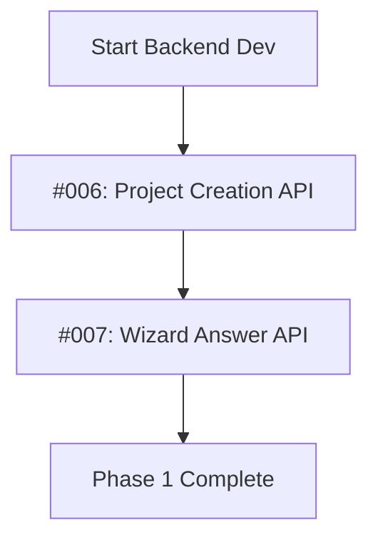
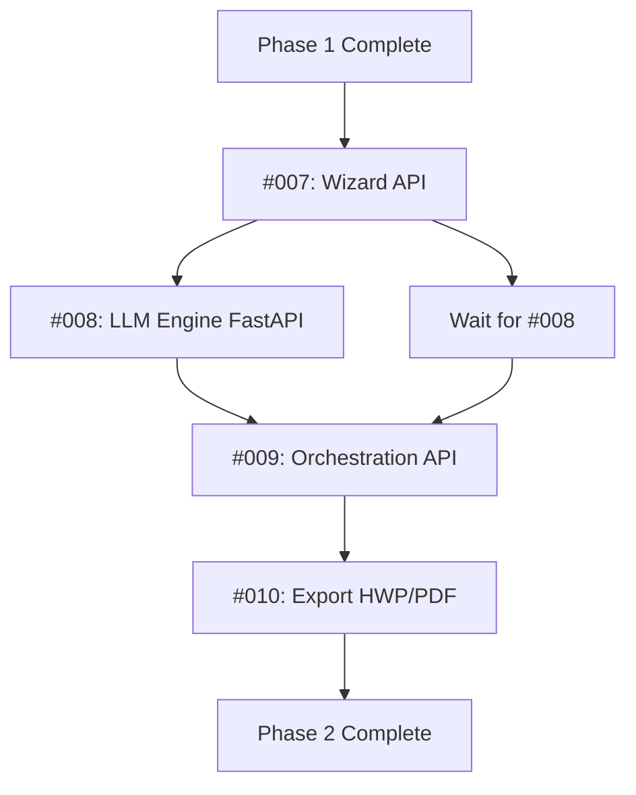
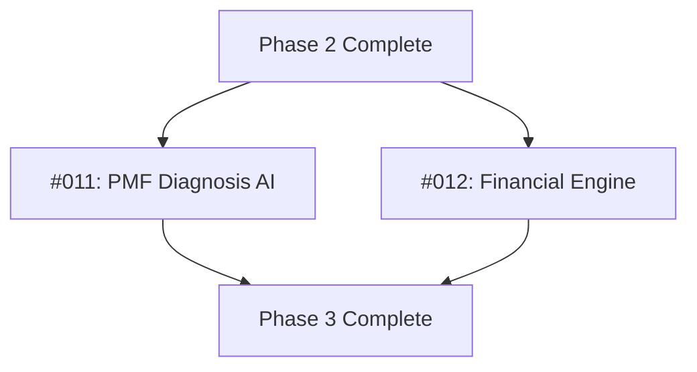
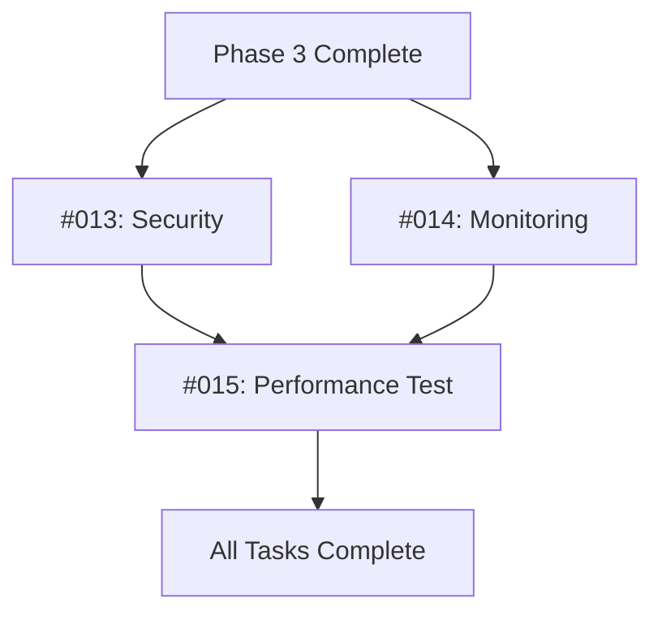

# GitHub Issues Execution Order & Parallel Development Strategy

## ⚠️ IMPORTANT NOTE
**EPIC 0 (Frontend PoC) - Issues #001-#005 are COMPLETED in a separate project.**  
These issues are excluded from GitHub issue creation for this backend project.

## 📋 Overview
This document defines the execution order for all GitHub issues, including information about which tasks can be developed in parallel and their dependencies.

## 🎯 Issue Summary
- **Total Issues**: 15 (10 active for this project)
- **EPIC 0 (Frontend PoC)**: Issues #001-#005 (5 issues) - ✅ **COMPLETED IN SEPARATE PROJECT**
- **EPIC 1 (Core Backend)**: Issues #006-#010 (5 issues) - 🔄 **ACTIVE**
- **EPIC 2 (Special Features)**: Issues #011-#012 (2 issues) - 🔄 **ACTIVE**
- **EPIC 3 (Non-Functional)**: Issues #013-#015 (3 issues) - 🔄 **ACTIVE**

### Active Issues for Backend Project
Total: **10 issues** (#006-#015)

---

## ✅ Phase 1: Frontend PoC Prototype - COMPLETED
**Status**: ✅ **COMPLETED IN SEPARATE PROJECT**  
**Issues #001-#005**: All frontend PoC tasks have been completed in a separate frontend project.

### Completed Tasks (Not in this project's GitHub issues)
| Issue # | Task ID | Title | Status |
|---------|---------|-------|--------|
| ~~#001~~ | EPIC0-FE-001 | 프로젝트 생성 및 Wizard 기본 레이아웃 PoC | ✅ Complete |
| ~~#002~~ | EPIC0-FE-002 | Wizard 입력 폼 및 자동저장 UI PoC | ✅ Complete |
| ~~#003~~ | EPIC0-FE-003 | 사업계획서 초안 생성 및 뷰어 UI PoC | ✅ Complete |
| ~~#004~~ | EPIC0-FE-004 | 재무 입력 및 유닛 이코노믹스 시각화 UI PoC | ✅ Complete |
| ~~#005~~ | EPIC0-FE-005 | PMF 진단 설문 및 리포트 UI PoC | ✅ Complete |

**Note**: These issues will NOT be created in GitHub for this backend project.

---

## 📅 Phase 1 (Backend): Core Backend Foundation (Week 1)
**Goal**: Build foundational backend APIs

### Sequential Execution Required

| Issue # | Task ID | Title | Effort | Dependencies | Blocks |
|---------|---------|-------|--------|--------------|--------|
| #006 | REQ-FUNC-001-BE-001 | 프로젝트 생성 및 템플릿 목록 API | M | None | #007, #013, #014 |
| #007 | REQ-FUNC-002-BE-001 | Wizard 단계별 답변 저장/조회 API | M | #006 | #009 |

### Execution Strategy


**Notes**:
- ✅ Frontend PoC is already complete (separate project)
- Backend development starts directly with #006
- MUST be executed sequentially (#006 → #007)
- #006 establishes DB schema and base entities
- #007 depends on Project entity from #006
- Recommended team allocation: 2 backend developers
- Expected duration: 1 week

---

## 📅 Phase 2: AI Pipeline & Integration (Week 2-3)
**Goal**: Implement AI document generation pipeline

### Parallel Development with Integration Point

| Issue # | Task ID | Title | Effort | Dependencies | Parallelizable |
|---------|---------|-------|--------|--------------|----------------|
| #008 | REQ-FUNC-003-AI-001 | 사업계획서 생성 LLM 엔진 (FastAPI) | L | #007 (data structure) | ✅ Yes |
| #009 | REQ-FUNC-003-BE-001 | 사업계획서 생성 오케스트레이션 API | L | #007, #008 | ❌ No |
| #010 | REQ-FUNC-011-BE-001 | HWP/PDF 내보내기 기능 | M | #009 | ❌ No |

### Execution Strategy


**Notes**:
- #008 (FastAPI) can start development immediately after #007
- #009 (Orchestration) requires BOTH #007 (data) and #008 (LLM service)
- #010 (Export) requires completed documents from #009
- Recommended team allocation: 
  - 1 AI/Python developer for #008
  - 2 backend developers for #009, #010
- Expected duration: 2 weeks

---

## 📅 Phase 3: Special Features (Week 4)
**Goal**: Implement PMF diagnosis and financial calculation

### Parallel Group B: Special Features (Can run simultaneously)

| Issue # | Task ID | Title | Effort | Dependencies | Parallelizable |
|---------|---------|-------|--------|--------------|----------------|
| #011 | REQ-FUNC-008-AI-001 | PMF 진단 및 리포트 생성 LLM 엔진 | M | #008 (LLM infra) | ✅ Yes |
| #012 | REQ-FUNC-012-BE-001 | 재무 추정 및 유닛 이코노믹스 계산 엔진 | L | #006 | ✅ Yes |

### Execution Strategy


**Notes**:
- Both tasks are FULLY PARALLEL
- #011 shares LLM infrastructure with #008
- #012 is independent calculation engine
- Recommended team allocation:
  - 1 AI developer for #011
  - 1 backend developer for #012
- Expected duration: 1 week

---

## 📅 Phase 4: Non-Functional Requirements & QA (Week 5)
**Goal**: Ensure security, monitoring, and performance

### Parallel Group C: NFR Implementation (Can run simultaneously)

| Issue # | Task ID | Title | Effort | Dependencies | Parallelizable |
|---------|---------|-------|--------|--------------|----------------|
| #013 | REQ-NF-006-SEC-001 | 데이터 저장/전송 암호화 및 보안 구성 | M | #006 | ✅ Yes |
| #014 | REQ-NF-012-OPS-001 | 구조화된 로깅 및 Prometheus/Grafana 모니터링 | M | #006 | ✅ Yes |
| #015 | REQ-NF-001-PERF-001 | API 성능 목표 검증을 위한 k6 부하 테스트 | M | #009 | ❌ No (Final) |

### Execution Strategy


**Notes**:
- #013 (Security) and #014 (Monitoring) can start simultaneously
- #015 (Performance Test) should run AFTER all features are complete
- #015 validates the entire system
- Recommended team allocation:
  - 1 DevOps/Security engineer for #013, #014
  - 1 QA engineer for #015
- Expected duration: 1 week

---

## 📊 Dependency Matrix (Backend Issues Only)

> **Note**: Issues #001-#005 (Frontend PoC) are completed in a separate project and excluded from this matrix.

| Issue | Depends On | Blocks | Can Parallelize With |
|-------|------------|--------|---------------------|
| #006 | - (Frontend complete) | #007, #013, #014 | - |
| #007 | #006 | #008, #009 | - |
| #008 | #007 | #009 | - |
| #009 | #007, #008 | #010, #015 | - |
| #010 | #009 | - | - |
| #011 | #008 | - | #012 |
| #012 | #006 | - | #011 |
| #013 | #006 | - | #014 |
| #014 | #006 | - | #013 |
| #015 | #009 | - | - |

---

## 🔄 Critical Path Analysis (Backend Only)

### Critical Path (Longest Duration)
```
✅ Frontend PoC Complete (separate project)
  ↓
Phase 1: #006 (M) → #007 (M)
  ↓
Phase 2: #008 (L) → #009 (L) → #010 (M)
  ↓
Phase 3: #012 (L) [parallel, but longest in phase]
  ↓
Phase 4: #015 (M)
```

**Total Critical Path Estimated Duration**: 5 weeks (Backend only)

**Note**: Frontend PoC (1 week) was completed separately, reducing total project timeline.

### Parallel Paths (Can reduce overall timeline)
- **Path A**: PMF Feature (#011) - Can overlap with Phase 3
- **Path B**: Security & Monitoring (#013, #014) - Can overlap with Phase 4

---

## 👥 Recommended Team Allocation (Backend Project)

### Optimal Team Structure
```yaml
Backend Developers: 3
  - Developer 1: Core APIs (#006, #007)
  - Developer 2: Orchestration & Export (#009, #010)
  - Developer 3: Financial Engine (#012)
  - Duration: Week 1-5

AI/Python Developers: 1-2
  - Focus: LLM Services (#008, #011)
  - Duration: Week 2-4

DevOps/QA Engineer: 1
  - Focus: Security, Monitoring, Testing (#013, #014, #015)
  - Duration: Week 5

Note: Frontend team (3 developers) completed EPIC 0 in a separate project.
```

---

## 🚀 Execution Recommendations (Backend Project)

### ✅ Pre-Week 0: Frontend PoC (COMPLETED)
- **Status**: ✅ Completed in separate project
- **Issues #001-#005**: All frontend prototypes complete

### Week 1: Backend Foundation
- **Sequential**: #006 → #007
- **End of Week**: Core APIs ready

### Week 2-3: AI Pipeline
- **Week 2 Start**: #008 (FastAPI) development
- **Week 2 Mid**: #009 (Orchestration) development (waits for #008)
- **Week 3**: #010 (Export) development
- **End of Week 3**: Full document generation pipeline working

### Week 4: Special Features
- **Parallel**: #011 (PMF) + #012 (Financial)
- **End of Week**: All features complete

### Week 5: NFR & QA
- **Day 1-3**: #013 (Security) + #014 (Monitoring) in parallel
- **Day 4-5**: #015 (Performance Testing)
- **End of Week**: Production-ready backend system

---

## 📋 Issue Labels Summary (Active Backend Issues)

### By Epic
- `epic-0`: ~~Issues #001-#005 (Frontend PoC)~~ - ✅ **COMPLETED (Separate Project)**
- `epic-1`: Issues #006-#010 (Core Backend) - 🔄 **ACTIVE**
- `epic-2`: Issues #011-#012 (Special Features) - 🔄 **ACTIVE**
- `epic-3`: Issues #013-#015 (Non-Functional) - 🔄 **ACTIVE**

### By Priority
- `priority-must`: Issues #006-#010, #013-#015
- `priority-should`: Issues #011-#012

### By Type
- `feature`: Issues #006-#012
- `non-functional`: Issues #013-#015

### By Component (Backend Project Only)
- `backend`: #006-#007, #009-#010, #012-#014
- `ai`: #008, #011
- `testing`: #015

### Issues to Create in GitHub
**Total: 10 issues** (#006-#015)
- Exclude: #001-#005 (Frontend PoC - completed separately)

---

## ✅ Completion Checklist (Backend Project)

### Pre-Phase: Frontend PoC
- [x] All frontend prototypes demonstrate full user flow (✅ Completed separately)
- [x] UI/UX validated by stakeholders
- [x] Mock data flows correctly through all screens

### Phase 1 Complete When:
- [ ] Project and Wizard APIs functional
- [ ] Database schema established
- [ ] Integration tests passing

### Phase 2 Complete When:
- [ ] Documents can be generated from wizard answers
- [ ] PDF/HWP export working
- [ ] End-to-end flow tested

### Phase 3 Complete When:
- [ ] PMF diagnosis working with LLM
- [ ] Financial calculations accurate
- [ ] All special features integrated

### Phase 4 Complete When:
- [ ] Security measures implemented and audited
- [ ] Monitoring dashboards operational
- [ ] Performance targets met (P99 < 200ms)
- [ ] All tests passing

---

## 🎯 Success Metrics

### Phase Completion Targets
- **Pre-Phase (Frontend)**: ✅ 100% UI/UX validation (Completed)
- **Phase 1 (Backend)**: 100% Core API coverage
- **Phase 2**: End-to-end document generation working
- **Phase 3**: All features functional
- **Phase 4**: 
  - P99 API latency < 200ms
  - Error rate < 1%
  - Security audit passed
  - Test coverage > 80%

---

**Document Version**: 2.0  
**Last Updated**: 2025-12-14  
**Total Estimated Duration**: 5 weeks (Backend only, Frontend completed separately)  
**Total Issues**: 15 (10 active for backend, 5 completed in separate frontend project)  
**Issues to Create in GitHub**: 10 (#006-#015)

